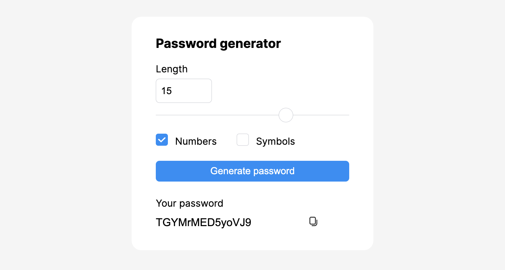

This repo contains the code of a password generator. It's useful program that generate random password for your services.\ 
You can choose whether use or not special symbols and numbers and configure the length of a password (4-20 characters).\
There is alse a feature that can copy generated password to your clipboard.\

## Stack:

- JavaScript
- React
- CSS (CSS Modules)

## To run the app:

1. Install node (node version of the project: 18.13.0)
2. Install dependencies: `npm install`
3. To run the project in the development mode: `npm start`

The project will be available at `http://localhost:3000`.